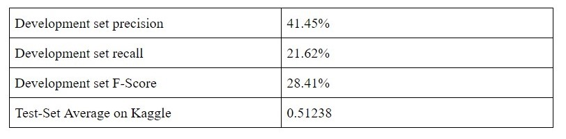

# 🧮Sentiment Analysis on Movie Reviews

**[a challenge on Kaggle](https://www.kaggle.com/c/sentiment-analysis-on-movie-reviews)**

## Project Brief

In order to classify sentences on a five point scale: `negative, slightly negative, neutral, slightly positive, positive`, we are developing a sentiment analysis classifier to determine the sentiment of a piece of text.

The current Naive Bayes classifier, found in the baseline directory achieves a simple classification based on whether or not a words with a particular sentiment appears in the sentence

To run the Naive Bayes Classifier on the development set:

```bash
# this will output a file in the folder outputs called NB_file_output.csv
python3 baselines/baselineNB.py dataset/development.tsv
```

To evaluate the algorithm against the development set:

```bash
python3 evaluation/evaluate_f_score.py outputs/NB_file_output.tsv dataset/devanskey.tsv
```

## Results

Current results show that the baseline algorithm has an F-Score of 28.41% against the development set and an accuracy score of 51.24% when run against the test set and evaluated on Kaggle


## TODO

- [ ] Add and test more features to the Naive Bayes Classifier
- [ ] Combine the baseline algorithm with others to improve score
